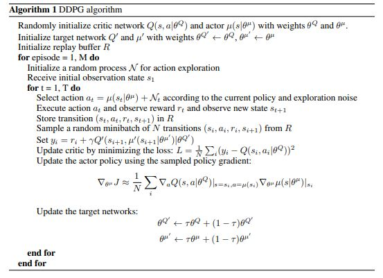
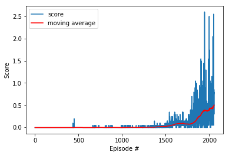

# Tennis Project report


## Introduction

In the Tennis environment, a reward of +0.1 is provided for each step if an agent hits the ball over the net. If an agent lets a ball hit the ground or hits the ball out of bounds, it receives a reward of -0.01. Thus, the goal of each agent is to keep the ball in play as long as possible. 


The observation space consists of 8 variables corresponding to the position and velocity of the ball and racket. Each agent receives its own, local observation. Two continuous actions are available, corresponding to movement toward (or away from) the net, and jumping.

The environment is considered solved, when the average (over 100 episodes) of those scores is at least +0.5.
To meet the requires, two agents are created using the Deep Deterministic Policy Gradient algorithm (DDPG) [Continuous control with deep reinforcement learning](https://arxiv.org/abs/1509.02971).

The two DDPG agents successfully solve the environment after 1958 episodes.


## Brief overview of DDPG algorithm
DDPG is an algorithm which cocurrently learns an action and Q-value and consists of an actor and a critic network. 
* Given a state the actor learns to predict action from Q-value. 
* Using off-policy data, i.e, a state and an action pair, the critic learns to estimate Q-values. 

The algorithm is closely connected to DQN. Given the optimal Q-value, the optimal action is the one which generates the 
optimal Q-value in any given state. DDPG interleaves learning to estimate optimal Q-value with learning to estimate the optimal action. 

In addition, DDPG uses experience replay and Ornstein–Uhlenbeck process.
* Experience replay is used to randomly sample batches to reduce the correlation of experiences in training. 
* Ornstein–Uhlenbeck process generates Gaussian noise to explore the action space.

The details of DDPD algorithm described in the fellowing pseuocode



## Implementation

The model is implemented using torch framework and python 3.  The same actor and same critic are used for two DDPG agents. The actor of DDPG consists of an input, an output and a number of hidden layers:

```
        input = nn.Linear(state_size, actor_units[0])
        batch_norm = nn.BatchNorm1d(actor_units[0])
        hidden_layers = nn.ModuleList([nn.Linear(size_in, size_out) for size_in, size_out in zip(actor_units[:-1], actor_units[1:])])
        output = nn.Linear(actor_units[-1], action_size)
```
where state_size = 24 is the dimension of each state, action_size = 2 is the dimension of each action. actor_units is an array of hidden layer units. The batch normalization 
is applied to the first layer.

The architecture of the critic  is similar to the actor, consisting of also an input, an output and a number 
of hidden layers:

```
        input = nn.Linear(state_size, critic_units[0])
        batch_norm = nn.BatchNorm1d(critic_units[0])
        critic_units[0] += action_size
        hidden_layers = nn.ModuleList([nn.Linear(size_in, size_out) for size_in, size_out in zip(critic_units[:-1], critic_units[1:])])
        output = nn.Linear(critic_units[-1], 1)
```
critic_units is an array to define hidden layer units. The batch normalization 
is applied to the first layer. Utility helper contains a couple of functions to help the actor and the critic to reset parameters.

As in the standard DDPG, the experience replay uses a replay buffer (ReplayBuffer). ReplayBuffer is implemented using namedtuple and deque of python collections

```
   memory = deque(maxlen=buffer_size) 
   experience = namedtuple("Experience", field_names=["state", "action", "reward", "next_state", "done"])
```
An experience is a named tuple consisting of state, action, reward, next state and done, where done flags if the terminated state is reached. 
In addition, Ornstein-Uhlenbeck process is used as well.

The model can be configured differently by different configurations using Config class, for example,  by selecting  different number of hidden layers and choosing different unit sizes for hidden layers. 
After some parameter tuning, actor_units=critic_units=[256, 256] is selected in the final run.

## Hyper parameters

Other hyper parameters used in the model are 

* Replay buffer size: 100,000 
* batch size: 128
* Discount factor: 0.99 (gamma)
* Soft update factor: 0.001 (tau)
* Learning rate of the actor: 0.0001 
* Learning rate of the critic: 0.0001 

## Results
The graph shows the rewards per episode 



The average scores per 100 episodes as shown as follows. The model solves the environment after 1985 episodes. The agent receives average score more than 0.5 over the last 100 episode.  

```
Episode 100	Average Score: -0.00
Episode 200	Average Score: -0.00
Episode 300	Average Score: -0.00
Episode 400	Average Score: -0.00
Episode 500	Average Score: -0.00
Episode 600	Average Score: -0.00
Episode 700	Average Score: -0.00
Episode 800	Average Score: -0.00
Episode 900	Average Score: -0.00
Episode 1000	Average Score: -0.00
Episode 1100	Average Score: 0.000
Episode 1200	Average Score: -0.00
Episode 1300	Average Score: 0.000
Episode 1400	Average Score: 0.01
Episode 1500	Average Score: 0.02
Episode 1600	Average Score: 0.06
Episode 1700	Average Score: 0.09
Episode 1800	Average Score: 0.08
Episode 1900	Average Score: 0.27
Episode 2000	Average Score: 0.39
Episode 2058	Average Score: 0.50
Environment solved in 1958 episodes!	Average Score: 0.50
```

## Conclusions

DDPG performs very well to achieve the goal. The model can be easily modify to solve the second version of the environment.
Other actor-critic algorithms can also be used to solve this kind of environment 

* A3C - Asynchronous Advantage Actor-Critic
* A2C - Advantage Actor-Critic
* PPO - Proximal Policy Optimization
* D4PG - Distributed Distributional Deterministic Policy Gradients

It is very interesting to compare them with DDPG. Some of them, for example D4PG,  very likely perform better.


